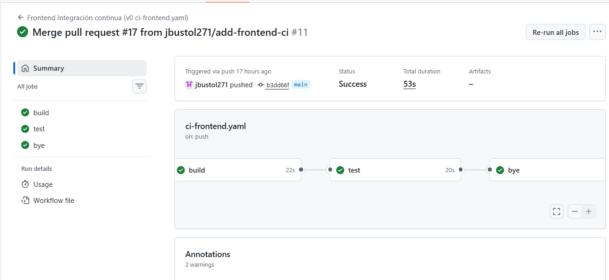
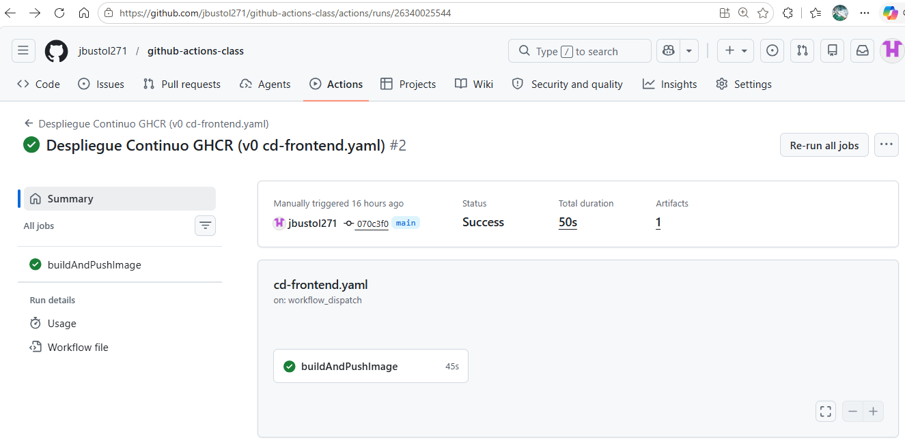
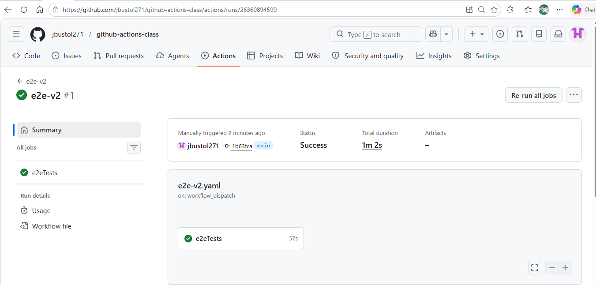
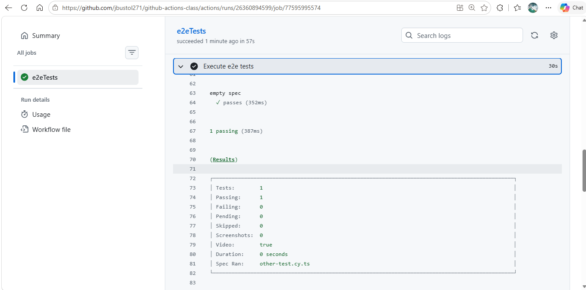

**github actions class - Laboratory**

> ### Ejercicio 1
He creado el archivo  ** github/workflows/ci-frontend.yaml **
con el objetivo de realizar una integración continua del frontend ** hangman-front **, instalar las dependencias, realizar el build del proyecto y lanzar los test unitarios.

Tenemos tres jobs:

 - **build:** realiza un chequeo del repositorio, configura node 18, instala dependencias y realiza el buil del proyecto.
 
 - **test:** en dependiente de build, hace lo mismo que el anterior, con la diferencia de que en lugar de hacer un build, corre los tests. Este al ejecutarse produce un error en concreto en el archivo xxx en la línea 16. **expect(items).toHaveLength(1);**
	 El problema está:
		 -   Line 10: Mock returns 2 topics
		 -   Line 16: Test expects 1 list item
				La he cambiado para recibir los 2.
 
 - **bye:** para indicar la finalización, tal y como hemos hecho en clase.

### Ejercicio 2
Se crea el archivo `.github/workflows/cd-frontend.yml`, cuya ejecución manual construye y publica en GHCR una imagen docker de nuestro frontend. 

Para esto hace lo siguiente: checkout del repositorio, comprobación de la versión de docker, login en GHCR usando el token de github, configuración de docker buildx y construcción y publicación de la imagen en el anteriormente mencionado repositorio. 

### Ejercicio 3

En este workflow automatizo la ejecución de pruebas end‑to‑end sobre un entorno efímero generado en GitHub Actions. Primero recupero el código del repositorio y me autentico contra GitHub Container Registry para poder acceder a las imágenes Docker privadas. A continuación consulto la API de GitHub para obtener dinámicamente la versión más reciente tanto de la imagen de la API como de la del frontend, garantizando que las pruebas se ejecutan siempre contra la última build disponible.

Con los tags obtenidos, levanto ambos servicios en contenedores Docker dentro del runner: la API expuesta en el puerto 3001 y el frontend en el 8080, configurado mediante variables de entorno para comunicarse con la API. Una vez desplegado el entorno completo, instalo las dependencias necesarias para Cypress y ejecuto la suite de pruebas end‑to‑end contra los servicios levantados, validando el comportamiento real de la aplicación en un entorno aislado y reproducible.

